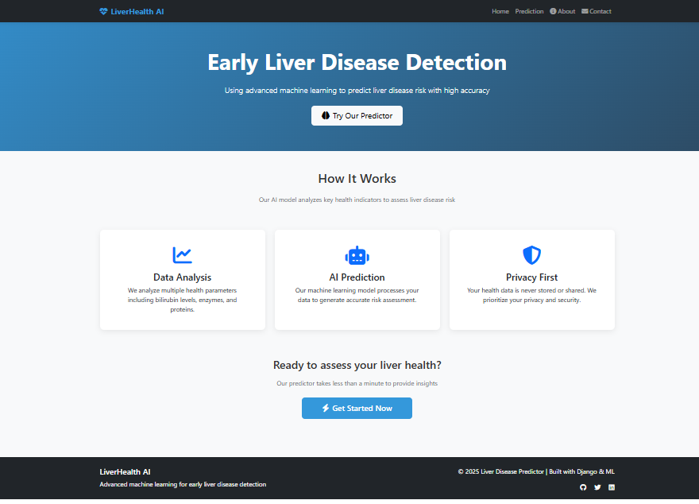
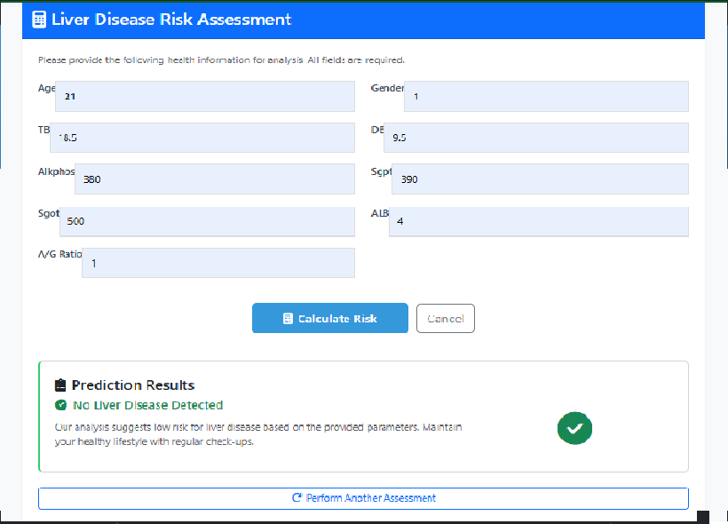
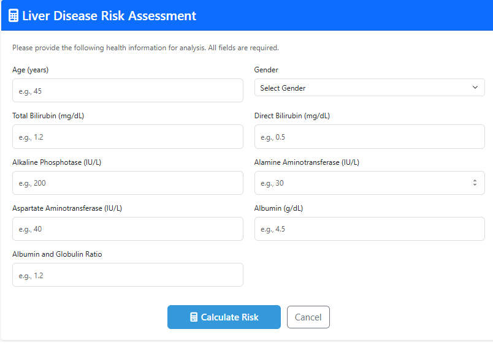
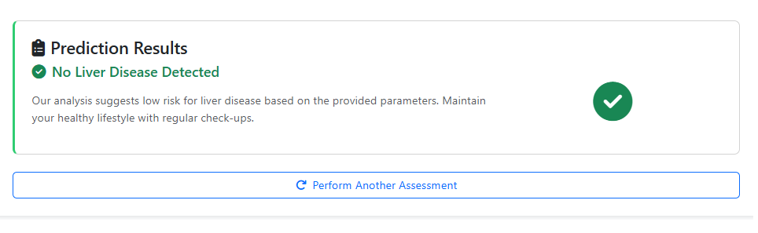
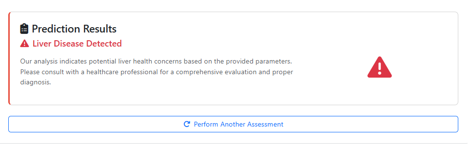

# Liver Disease Prediction Web Application

A machine learning-based web application for predicting liver disease risk using patient health parameters. Built with Django and Scikit-learn.

## 📋 Project Overview

This web application uses a trained machine learning model to predict the likelihood of liver disease based on various health parameters such as bilirubin levels, enzymes, and proteins. The model was trained on the Indian Liver Patient Dataset from the UCI Machine Learning Repository.


## 🚀 Features

- **User-friendly Web Interface**: Clean, professional medical form for inputting patient data
- **Machine Learning Prediction**: Accurate liver disease risk assessment using SVM algorithm
- **Real-time Results**: Immediate prediction with confidence percentage
- **Responsive Design**: Works on desktop and mobile devices
- **Professional UI**: Medical-grade interface with Bootstrap styling

# 📊 Dataset Information

**Dataset:** Indian Liver Patient Dataset (ILPD)  
**Download URL:** [ILPD Dataset](https://archive.ics.uci.edu/ml/machine-learning-databases/00225/Indian%20Liver%20Patient%20Dataset%20(ILPD).csv)

---

## 📖 Dataset Description
The dataset contains **583 patient records** with **10 features** and **1 target variable** (liver disease status).  
The data was collected from **northeast Andhra Pradesh, India**.

---

## 🔑 Features Used
- **Age**
- **Gender**
- **Total Bilirubin (TB)**
- **Direct Bilirubin (DB)**
- **Alkaline Phosphotase (Alkphos)**
- **Alamine Aminotransferase (Sgpt)**
- **Aspartate Aminotransferase (Sgot)**
- **Total Proteins (TP)**
- **Albumin (ALB)**
- **Albumin and Globulin Ratio (A/G Ratio)**

---

## 🎯 Target Variable
- **Liver Disease**
  - `1` → Liver Patient  
  - `2` → Non-Liver Patient  


## 🛠️ Technology Stack

- **Backend**: Django 5.2.5
- **Frontend**: HTML5, CSS3, Bootstrap 5, JavaScript
- **Machine Learning**: Scikit-learn, Pandas, NumPy
- **Model Persistence**: Joblib
<!-- - **Deployment Ready**: Render.com compatible -->

## 📦 Installation Guide

### Prerequisites

- Python 3.8+
- pip (Python package manager)
- Git

### Step 1: Clone the Repository

```bash
git clone https://github.com/The-mRu/ML-Final-Lab-Project-.git
cd liver-disease-predictor
```

### Step 2: Create Virtual Environment

```bash
# On Windows
python -m venv venv
venv\Scripts\activate

# On macOS/Linux
python3 -m venv venv
source venv/bin/activate
```

### Step 3: Install Dependencies

```bash
pip install -r requirements.txt
```

### Step 4: Check Model Files

Place your trained model files in the `predictor/models/` directory:
- `best_model.pkl` - Trained machine learning model
- `scaler.pkl` - Fitted StandardScaler
- `feature_names.json` - List of feature names in correct order

<!-- ### Step 5: Configure Database

```bash
python manage.py migrate
``` -->

<!-- ### Step 6: Create Superuser (Optional)

```bash
python manage.py createsuperuser
``` -->

### Step 5: Run Development Server

```bash
python manage.py runserver
```

Visit `http://127.0.0.1:8000/` in your browser to access the application.

## 📁 Project Structure

```
liver-disease-predictor/
├── liver_django/                 # Django project settings
│   ├── settings.py
│   ├── urls.py
│   └── wsgi.py
├── predictor/                    # Main application
│   ├── models.py
│   ├── views.py
│   ├── urls.py
│   ├── model_loader.py          # ML model loading and prediction
│   └── templates/
│       └── predictor/
│           ├── home.html
│           └── predict.html
│                      
│       └── base.html
├── models/                     # Machine learning models (not in version control)
│   ├── best_model.pkl
│   ├── scaler.pkl
│   └── feature_names.json
├── requirements.txt
└── manage.py
```

## 🎯 How to Use
Go to 

> [Liver Health AI  (https://liver-disease-prediction-95i8.onrender.com/)](https://liver-disease-prediction-95i8.onrender.com/)
1. **Access the Application**: Open your browser and go to the application URL
2. **Navigate to Prediction Page**: Click on "Predict" in the navigation menu
3. **Enter Patient Data**: Fill in all required health parameters
4. **Get Prediction**: Click "Calculate Risk" to see the prediction results
5. **Interpret Results**: 
   - ✅ Green checkmark = No liver disease detected
   - ⚠️ Red warning triangle = Liver disease detected

<!-- ## 🔧 Configuration

### Environment Variables

Create a `.env` file for local development:

```env
SECRET_KEY=your-secret-key-here
DEBUG=True
``` -->

### Model Training (Optional)

If you want to retrain the model:

1. The original training code is based on the Indian Liver Patient Dataset
2. The model uses SVM with RBF kernel (C=10, gamma=0.1)
3. Dataset is balanced using SMOTE technique
4. Features are standardized using StandardScaler

<!-- ## 🌐 Deployment

This project is configured for easy deployment on Render.com. See the `render.yaml` and `build.sh` files for deployment configuration. -->


## 📊 Model Performance

The machine learning model was evaluated using multiple algorithms to ensure the best performance for liver disease prediction:

### Algorithm Comparison Results:
- **Naive Bayes**: 66.47% Accuracy
- **K-Nearest Neighbors (KNN)**: 72.46% Accuracy  
- **Support Vector Machine (SVM)**: 75.45% Accuracy
- **Logistic Regression**: 76.65% Accuracy
- **Ensemble Bagging**: 82.04% Accuracy ✅

### Selected Algorithm: Ensemble Bagging
Based on comprehensive testing, the **Ensemble Bagging** algorithm demonstrated the highest prediction accuracy at **82.04%** and was selected for the production model.

### Model Characteristics:
- **Algorithm**: Ensemble Bagging Classifier
- **Accuracy**: 82.04% (on test data)
- **Features**: 9 clinical parameters
- **Dataset**: Indian Liver Patient Dataset (ILPD)
- **Preprocessing**: SMOTE balancing, StandardScaler normalization
- **Validation**: Stratified 80/20 train-test split

The Ensemble Bagging approach combines multiple base estimators to improve generalization and reduce overfitting, making it particularly effective for medical prediction tasks where accuracy is critical.

# 📸 Screenshots
## Homepage

## Prediction Page
<!--  -->
### User Input

### Results




## ⚠️ Important Notes

- This tool is for informational purposes only
- Not a substitute for professional medical advice
- Always consult healthcare professionals for medical diagnoses
- Results should be interpreted by qualified medical personnel


## 📞 Support

If you have any questions or issues, please open an issue on GitHub or contact the development team.

---

**Disclaimer**: This application is intended for educational and research purposes only. It should not be used as a substitute for professional medical advice, diagnosis, or treatment.